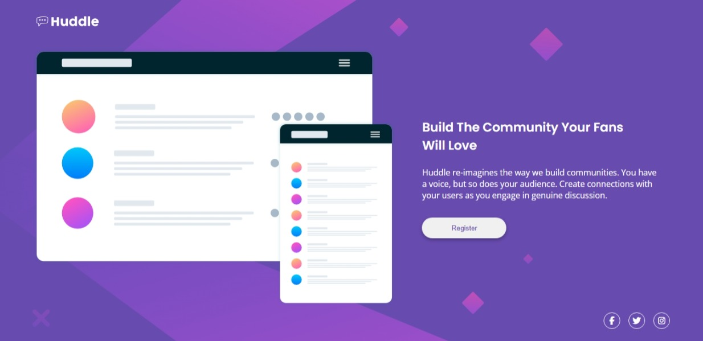

# Frontend Mentor - Huddle landing page with single introductory section solution

This is a solution to the [Huddle landing page with single introductory section challenge on Frontend Mentor](https://www.frontendmentor.io/challenges/huddle-landing-page-with-a-single-introductory-section-B_2Wvxgi0). Frontend Mentor challenges help you improve your coding skills by building realistic projects.

## Table of contents

- [Overview](#overview)
  - [The challenge](#the-challenge)
  - [Screenshot](#screenshot)
  - [Links](#links)
- [My process](#my-process)
  - [Built with](#built-with)
  - [What I learned](#what-i-learned)
  - [Continued development](#continued-development)
  - [Useful resources](#useful-resources)
- [Author](#author)
- [Acknowledgments](#acknowledgments)

## Overview

### The challenge

Users should be able to:

- View the optimal layout for the page depending on their device's screen size
- See hover states for all interactive elements on the page

### Screenshot

### Links

- Solution URL: [GitHub Repository]()
- Live Site URL: [Live Demo]()

## My process

### Built with

- Semantic HTML5 markup
- CSS custom properties
- Flexbox
- Mobile-first workflow
- Responsive layout

### What I learned

In this challenge, I practiced:

- Building a full-width **hero section** with image + text alignment
- Creating consistent **button styling and hover effects**
- Applying **mobile-first responsive techniques** using media queries
- Fine-tuning typography and layout spacing across screen sizes

### Continued development

Things I want to improve or explore further:

- Making the layout more flexible with `clamp()` for fluid sizing
- Improving accessibility for screen readers
- Testing layout in more browser environments

## Author

- Frontend Mentor - [@Innocent-Leo](https://www.frontendmentor.io/profile/Innocent-Leo)
- LinkedIn - [@Innocent-Okeke](https://www.linkedin.com/in/innocentokeke)
- Twitter - [@itz_saintleo](https://www.twitter.com/itz_saintleo)
